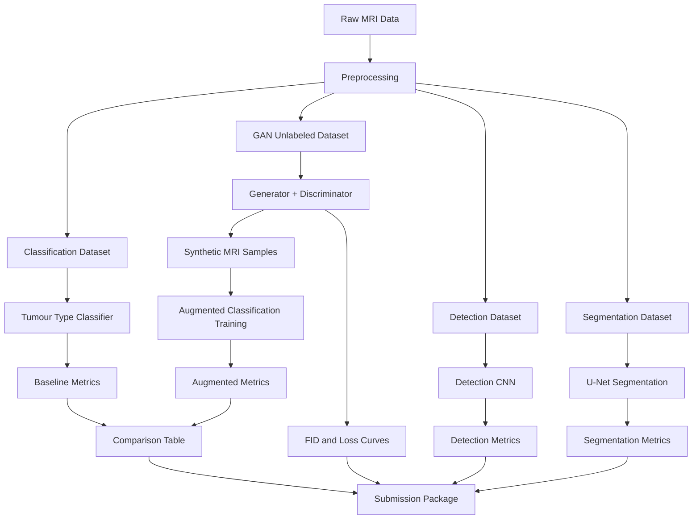

# Architecture Diagram

```mermaid
flowchart TD
    A[Raw MRI Data] --> B[Preprocessing]
    B --> C1[Detection Dataset]
    B --> C2[Classification Dataset]
    B --> C3[Segmentation Dataset]
    B --> C4[GAN Unlabeled Dataset]

    C1 --> D1[Detection CNN]
    C2 --> D2[Tumour Type Classifier]
    C3 --> D3[U-Net Segmentation]
    C4 --> D4[Generator + Discriminator]

    D4 --> E1[Synthetic MRI Samples]
    E1 --> F1[Augmented Classification Training]
    D2 --> G1[Baseline Metrics]
    F1 --> G2[Augmented Metrics]

    G1 --> H[Comparison Table]
    G2 --> H
    D4 --> I[FID and Loss Curves]
    D1 --> J[Detection Metrics]
    D3 --> K[Segmentation Metrics]

    H --> L[Submission Package]
    I --> L
    J --> L
    K --> L
```

## Notes

- FS is treated as F1-score until faculty defines another meaning.
- The key claim comes from baseline vs augmented classifier comparison.
